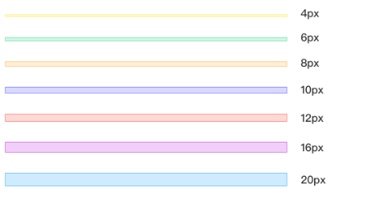
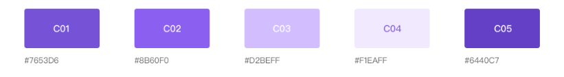
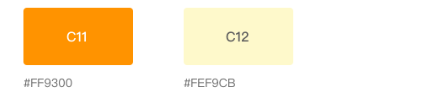
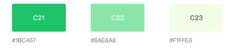
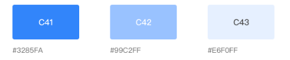
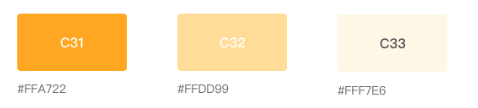
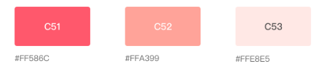
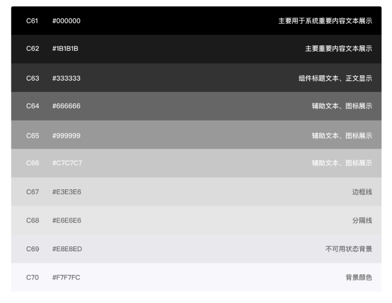
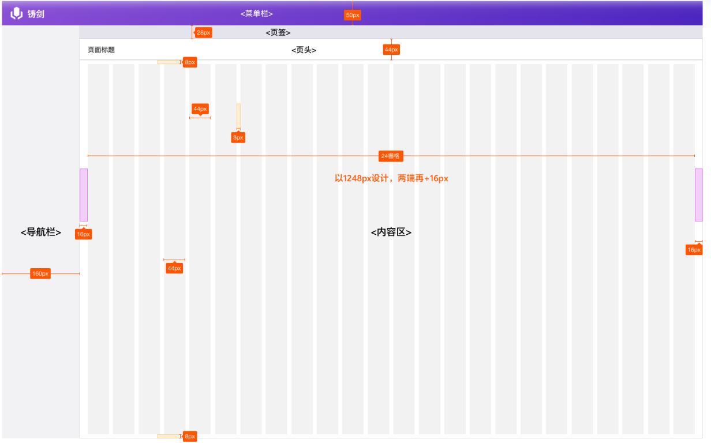

# ERP组件

## 通用

### 单位与间距

**单位**

为了让erp页面设计更加规范有序，所有组件、间隔尺寸尽量使用4px的倍数

**网格**

为了更好的规范erp页面的尺寸使用，我们使用七级网格标准，每级网格的基本单位为2px，参考

### 字体

**使用字体**

epr系统统一使用字体"微软雅黑"，sans-serif，不分Win和Mac

**字体使用规范**

规范表格指示字体大小的使用场景，及大小效果，具体使用需根据具体页面标注搭配颜色标准，行高默认为字体大小的1.5倍

| 编号 | 字号 | 粗细 | 应用场景                                         |
| ---- | ---- | ---- | ------------------------------------------------ |
| H1   | 16px | 加粗 | 特殊模块场景                                     |
| H2   | 14px | 加粗 | 标题类文本。如：页面标题、弹框标题、页面小标题等 |
| H3   | 14px | 常规 | 特殊位置文本。如:一级导航文本                    |
| H4   | 12px | 加粗 | 组件标题类文字。如：表单标题、列表标题、tab栏等  |
| H5   | 12px | 常规 | 重要文本。如:正文文本、提示框文本、组件正文文本  |

### 颜色

色彩体系主要定义了中台设计中的基础色板，中性色板和数据可视化色板

**主色**

* 紫色 系统主题颜色，使用场景：按钮颜色、可点击链接颜色等

* 橙色 系统重要颜色，使用场景：导航、tab等的选中状态

**辅助色**

* 绿色 用于成功状态提示

* 蓝色  用于提示状态

* 黄色 用于通告警告状态

* 红色 用于错误状态提示

**中性色**

中性色在系统页面中大量使用，合理使用中兴色系能令页面信息具有更好的层级关系，有助于提升使用体验

### 按钮

ERP系统按钮规范分有高度为28px和24px两种尺寸

重要按钮、线框按钮、文本图标 均有(带图标、不带图标)

还有纯图标按钮

**按钮尺寸**

常用尺寸28px，页面空间比较有限位置可以使用24px按钮，两种图标圆角均为2px

## 布局

### 页面结构

**层级**

从左到右层次类型分别是主题、蒙层、模态、警示、提醒。其中，不同层级不能相互穿透，且只有模态层(弹窗)可以叠加，模态之间的堆叠通过深度来表现

**布局**

### 菜单栏

### 导航栏

分为展开收起两种状态

### 页签与页头

## 导航

### 面包屑

### 步骤条

### 分页器

### 内容区导航

## 列表

### 列表布局

### 快捷查询

### 工具按钮/数据统计

### 标签栏

### 表格

### 模块组合

## 表单

### 表单布局

### 输入框

### 下拉框

## 弹窗

### 弹窗布局

### 弹窗样式

