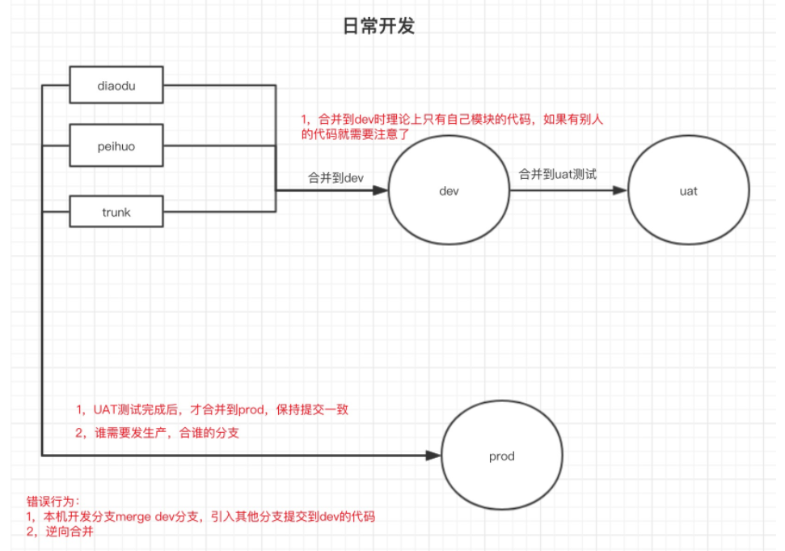

# git提交规范

## 业务模块

### 测试环境

将自己创建的分支首先合并到dev分支，然后将dev分支合并到stg/uat分支

### 生产环境

> 发布生产，发包的项目必须和发包流程上勾选的项目一致，且流程上选择的分支来自所选迭代所关联的禅道分支，发包前记得及时维护。后续等待产品提发包流程，走完流程后联系本部门对接的运维群，发送发包流程截图，提醒运维发包并进行跟进

把自己创建的分支提前提交合并申请到prod，联系上级进行代码审核并合并(最好提前一天)

> 标题：日期 + 开发的模块名
>
> 描述：完成的需求功能

## 公用模块

### 测试环境

用自己开发需求的分支合并到对应的测试分支stg/uat

### 生产环境

先将自己的开发分支合并到本部门在公用仓库的分支

然后将本部门在公用仓库的分支合并到prod

> 合并信息，注意事项同业务模块

## 发布上线

发布分包

发布整包

发布生产：把自己创建的分支合并到prod分支，若无合并权限，可以找有权限的人合并

> 代码发布成功后，如有需要同步通用查询、数据字典，需要找架构师或有生产同步权限同事，及时同步到生产

