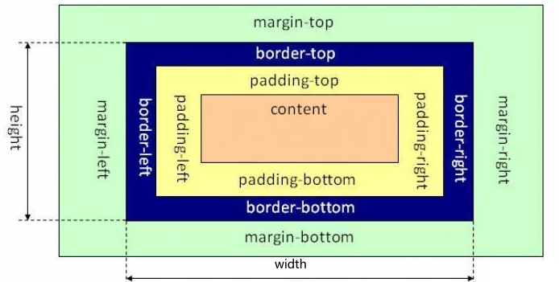

# CSS

层叠样式表 (**C**ascading **S**tyle **S**heets)，属于web前端的样式部分，W3C提倡结构与样式相分离

所谓层叠，即样式可以被覆盖，针对同一个属性，权重者为准，权重一致则后者覆盖前者

## 选择器

| 选择器       | 权重 | 描述                     |
| ------------ | ---- | ------------------------ |
| 通配符选择器 | 0    | 选中所有元素             |
| 标签选择器   | 1    | 选中所有一样的标签       |
| 伪类选择器   | 1    | 添加一些选择器的特殊效果 |
| class选择器  | 10   | 选中所有class一致的元素  |
| id选择器     | 100  | 选中所有id一致的元素     |

权重可以被叠加，256进制

**!important权重最高**

符号

> \+ 后面的第一个元素 
>
> \> 直系子元素

### 常用的伪类伪元素

| :hover   | 鼠标放上去触发 |
| -------- | -------------- |
| :after   | 元素之后       |
| :before  | 元素之前       |
| :checked | 选中的表单元素 |
| :active  | 正在活动的链接 |

```css
a:link {color:#FF0000;} /* 未访问的链接 */
a:visited {color:#00FF00;} /* 已访问的链接 */
a:hover {color:#FF00FF;} /* 鼠标划过链接 */
a:active {color:#0000FF;} /* 已选中的链接 */
```

**注意：** 在CSS定义中，a:hover 必须被置于 a:link 和 a:visited 之后，才是有效的。

**注意：** 在 CSS 定义中，a:active 必须被置于 a:hover 之后，才是有效的

## 盒模型

### 标准盒模型

总元素的宽度=宽度+左填充+右填充+左边框+右边框+左边距+右边距


### (IE)怪异盒模型

总元素的宽度=宽度+左边距+右边距



## CSS3

### 新增选择器:new:

* 属性选择器

设置 class 属性值包含 "test" 的所有 div 元素的背景色：

```css
div[class*="test"]
{
	background:#ffff00;
}
```

* 伪类选择器:first-child  选择父元素的第一个子元素，当然还有last-child
* 伪类选择器:empty没有子元素的
* 伪类选择器:nth-child(n)第n个子元素，n从1开始

### 新增属性:new:

> animation 
>
> `animation: name duration timing-function delay iteration-count direction fill-mode play-state;`
>
> | 值                        | 说明                                                         |
> | :------------------------ | :----------------------------------------------------------- |
> | animation-name            | 指定要绑定到选择器的关键帧的名称                             |
> | animation-duration        | 动画指定需要多少秒或毫秒完成                                 |
> | animation-timing-function | 设置动画将如何完成一个周期，可取值(linear\|ease\|ease-in\|ease-out\|ease-in-out\|steps(int, start\|end)\|cubic-bezier(n,n,n,n)) |
> | animation-delay           | 设置动画在启动前的延迟间隔。                                 |
> | animation-iteration-count | 定义动画的播放次数。                                         |
> | animation-direction       | 指定是否应该轮流反向播放动画。                               |
> | animation-fill-mode       | 规定当动画不播放时（当动画完成时，或当动画有一个延迟未开始播放时），要应用到元素的样式。 |
> | animation-play-state      | 指定动画是否正在运行或已暂停。                               |
>
> transform  应用于元素的2D或3D转换。这个属性允许你将元素旋转，缩放，移动，倾斜等
>
> | 值                                                           | 描述                                    |
> | :----------------------------------------------------------- | :-------------------------------------- |
> | none                                                         | 定义不进行转换。                        |
> | matrix(*n*,*n*,*n*,*n*,*n*,*n*)                              | 定义 2D 转换，使用六个值的矩阵。        |
> | matrix3d(*n*,*n*,*n*,*n*,*n*,*n*,*n*,*n*,*n*,*n*,*n*,*n*,*n*,*n*,*n*,*n*) | 定义 3D 转换，使用 16 个值的 4x4 矩阵。 |
> | translate(*x*,*y*)                                           | 定义 2D 转换。                          |
> | translate3d(*x*,*y*,*z*)                                     | 定义 3D 转换。                          |
> | translateX(*x*)                                              | 定义转换，只是用 X 轴的值。             |
> | translateY(*y*)                                              | 定义转换，只是用 Y 轴的值。             |
> | translateZ(*z*)                                              | 定义 3D 转换，只是用 Z 轴的值。         |
> | scale(*x*[,*y*]?)                                            | 定义 2D 缩放转换。                      |
> | scale3d(*x*,*y*,*z*)                                         | 定义 3D 缩放转换。                      |
> | scaleX(*x*)                                                  | 通过设置 X 轴的值来定义缩放转换。       |
> | scaleY(*y*)                                                  | 通过设置 Y 轴的值来定义缩放转换。       |
> | scaleZ(*z*)                                                  | 通过设置 Z 轴的值来定义 3D 缩放转换。   |
> | rotate(*angle*)                                              | 定义 2D 旋转，在参数中规定角度。        |
> | rotate3d(*x*,*y*,*z*,*angle*)                                | 定义 3D 旋转。                          |
> | rotateX(*angle*)                                             | 定义沿着 X 轴的 3D 旋转。               |
> | rotateY(*angle*)                                             | 定义沿着 Y 轴的 3D 旋转。               |
> | rotateZ(*angle*)                                             | 定义沿着 Z 轴的 3D 旋转。               |
> | skew(*x-angle*,*y-angle*)                                    | 定义沿着 X 和 Y 轴的 2D 倾斜转换。      |
> | skewX(*angle*)                                               | 定义沿着 X 轴的 2D 倾斜转换。           |
> | skewY(*angle*)                                               | 定义沿着 Y 轴的 2D 倾斜转换。           |
> | perspective(*n*)                                             | 为 3D 转换元素定义透视视图。            |
>
> transform-origin 属性允许您更改转换元素的位置。
>
> 2D转换元素可以改变元素的X和Y轴。 3D转换元素，还可以更改元素的Z轴
>
> linear-gradient()  函数用于创建一个表示两种或多种颜色线性渐变的图片。
>
> 创建一个线性渐变，需要指定两种颜色，还可以实现不同方向（指定为一个角度）的渐变效果，如果不指定方向，默认从上到下渐变。
>
> > ```css
> > /* 从上到下，蓝色渐变到红色 */
> > linear-gradient(blue, red);
> >  
> > /* 渐变轴为45度，从蓝色渐变到红色 */
> > linear-gradient(45deg, blue, red);
> >  
> > /* 从右下到左上、从蓝色渐变到红色 */
> > linear-gradient(to left top, blue, red);
> >  
> > /* 从下到上，从蓝色开始渐变、到高度40%位置是绿色渐变开始、最后以红色结束 */
> > linear-gradient(0deg, blue, green 40%, red);
> > ```
>
> > radial-gradient 径向渐变 "图像"。
> >
> > ```css
> > background-image: radial-gradient(shape size at position, start-color, ..., last-color);
> > ```
>
> filter 滤镜
>
> ```css
> filter: none | blur(px) | brightness(%) | contrast(%) | drop-shadow() | grayscale(%) | hue-rotate(%) | invert(%) | opacity(%) | saturate(%) | sepia(%) | url();
> ```
>
> 毛玻璃效果 模糊度 blur
>
> 亮度 brightness


## 响应式布局

即使用媒体查询，在窗口宽度发生改变达到一定条件之后，触发，更改样式

CSS3新增属性 @media

```css
@media only screen and (max-width: 500px) {
    body {
        background-color: lightblue;
    }
}
```


## Rem布局

em是一个相对单位，相对与当前对象文本字体尺寸，默认16px

CSS3新增的相对单位，**相对的是html根标签的字体大小**

对于适用各种移动设备，可使用rem，比如iPhone及iPad分辨率差别较大的设备

```css
p {font-size:14px; font-size:.875rem;}
```

常用的flex布局及Grid布局见[Flex布局](./flex.html)和[Grid布局](./grid.html)

## position: sticky

必须指定`top|bottom|left|right`任意一个或者任意两个值

设置`position:sticky`
使用条件：

1. 父元素不能`overflow:hidden`或者`overflow:auto`属性。

2. 必须指定`top、bottom、left、right`4个值之一，否则只会处于相对定位

3. 父元素的高度不能低于sticky元素的高度

4. sticky元素仅在其父元素内生效

## 深度选择器

CSS中使用 `>>>`

less及sass等预编译语言中使用/deep/

## 重绘和回流

回流，元素规模尺寸，布局，隐藏新增等改变会导致回流，浏览器会使重新渲染树中受到影响的部分失效，并重新构造这部分渲染树，完成回流，会重新绘制受影响的部分到屏幕中，完成回流后，重绘受影响部分

重绘，一些元素的更新只影响元素的外观，风格，不会影响布局

浏览器维护了一个队列，会把所有引起回流、重绘的操作放入这个队列，队列中任务到了一定数量或者到了一定时间间隔，浏览器就会清空队列，进行批处理，这样会将多次重绘回流变成一此重绘回流
